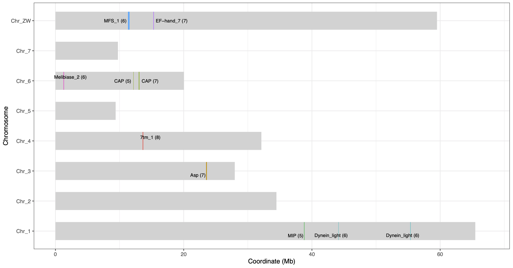
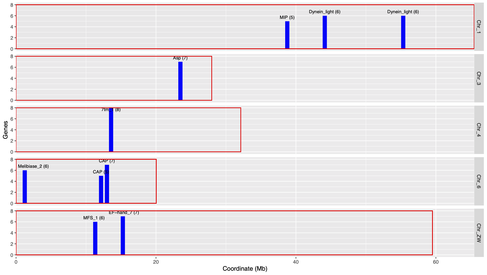

# FunctionalClusters_adjacentGenes
A little script to find chromosomal clusters of adjacent genes with the same function (e.g. Pfam/InterPro/gene family etc). 

Doesn't consider the strandness.

## Input files

#### 1. gene-chr-start.txt (must list all genes)

~~~~~~
Smp_329140 SM_V7_1 88327
Smp_315690 SM_V7_1 103403
Smp_317470 SM_V7_1 256087
~~~~~~

#### 2. gene-func.txt (gene and domain ids separated by ,)

~~~~~~
Smp_000020	PF07555
Smp_000040	PF13374,PF13424
Smp_000050	PF00520
~~~~~~

#### 3. func-names.txt (domain id and name)

~~~~~~
PF00001	7tm_1
PF00002	7tm_2
~~~~~~

#### 4. chr-length.txt (chromosome lengths for plotting, seprated by " ")

~~~~~~
SM_V7_1 88881357
SM_V7_2 48130368
...
~~~~~~

## Run the script

    ./_functionalClusters.sh

## Output files
- all-Clusters.txt (all clusters with >=3 adjacent genes)
~~~~~~
# chr accession ID No_of_genes coordinate_first_gene coord_last_gene genes chr_length
Chr_1 PF00230 MIP 5 38759469 38848004 Smp_005740,Smp_125220,Smp_005720,Smp_125210,Smp_125200 65476681
Chr_6 PF00188 CAP 5 12148934 12192119 Smp_176180,Smp_176160,Smp_120670,Smp_176170,Smp_154260 20041393
Chr_ZW PF04749 PLAC8 3 39608810 39642626 Smp_135250,Smp_024180,Smp_244390 59508269
Chr_ZW PF13499 EF-hand_7 7 15262895 15348004 Smp_032950,Smp_139970,Smp_032970,Smp_032980,Smp_032990,Smp_033000,Smp_033010 59508269
...
~~~~~~
- all-Clusters.txt_geneCoord.pdf (plotting clusters based on gene coordinates; >=5 genes)

- all-Clusters.txt_geneCounts.pdf (plotting clusters with gene count bars)

